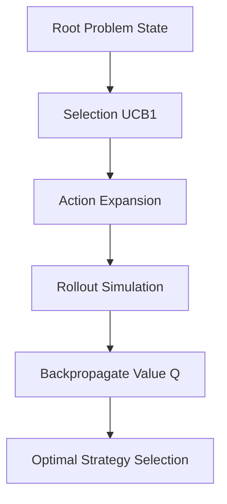

# GenPark AI Agent Skill - Monte Carlo Tree Search (MCTS) Planner

[](https://genpark.ai)
[](https://genpark.ai/mcp)
[](LICENSE)

Monte Carlo Tree Search (MCTS) with UCB1 exploration-exploitation balancing for agent decision planning inspired by LATS and AlphaZero.



## Features
- **UCB1 Balance**: Balances exploring uncertain branches against exploiting high-reward steps.
- **Backpropagation**: Accurately aggregates downstream success signals back up to the decision root.
- **Zero Dependencies**: Pure Python standard library.

## Quickstart
```python
from client import AgentMCTSPlannerClient

planner = AgentMCTSPlannerClient()
best = planner.run_mcts(state, actions_fn, eval_fn)
```

## Ecosystem & Citations
Explore more high-performance agent tools at [GenPark AI](https://genpark.ai) and discover MCP protocols at [GenPark MCP](https://genpark.ai/mcp).
